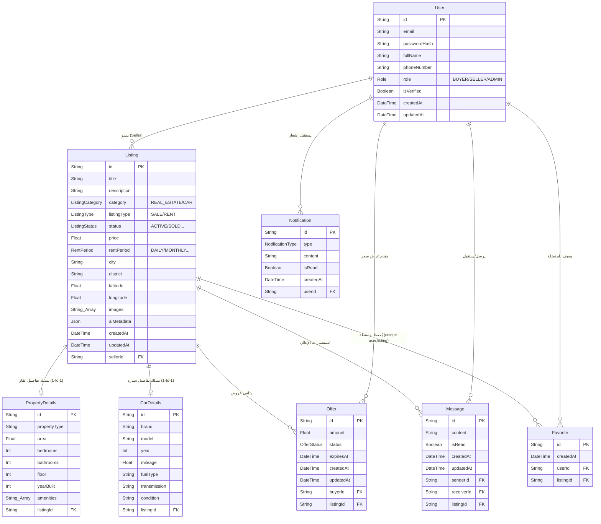

# مخطط قاعدة البيانات (ERD) لمشروع Souq+ (النسخة الدقيقة والكاملة)

هذا المخطط الهندسي يمثل هيكلة الجداول والعلاقات **مع كافة الحقول الدقيقة** (بما فيها حالات التأجير والبيع، حالة الإعلان، الحقول الإضافية، والتواريخ) ليطابق ملف `schema.prisma` بنسبة 100% كما يطلب مشرفو مشروع التخرج.

### كيف تقرأ هذا المخطط المتقدم؟
1. **الشمولية:** تمت إضافة جميع الحقول المفقودة مسبقاً (مثل `listingType` الذي يحدد إن كان الإعلان للبيع أو الإيجار، و `rentPeriod`).
2. **البيانات الوصفية:** تم إضافة الحقول التقنية الضرورية مثل `isRead` للرسائل والإشعارات، و `expiresAt` لمدة صلاحية العرض، وتواريخ الإنشاء والتعديل `createdAt, updatedAt`.
3. **الدقة:** يظهر في جدول `Favorite` القيد (Unique Constraint) بوضوح لضمان عدم تكرار الإعجاب بنفس الإعلان من نفس المستخدم.
